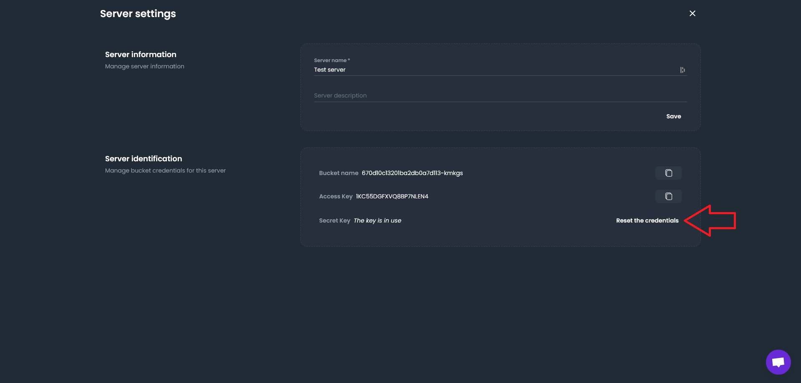

# Reset server credentials

You can easily change a server's credentials following unauthorized access or for security reasons. To do this, go to the 'Servers' section of your dashboard, then click on the gear icon in the top right corner.

You can then click on 'Reset the credentials' to modify the server's username and password.

:::note
Remember to update the Snaper configuration with new credentials by editing the _~/.config/snaper/config.yaml_ file.
:::
