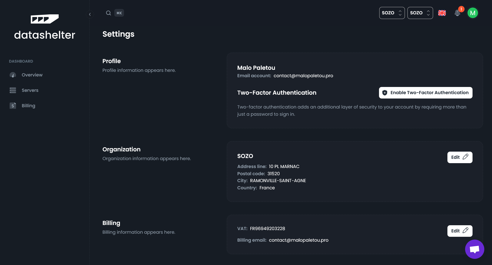

# How to activate Two-Factor Authentication (2FA)?

### 1. Go to your account settings by clicking on the gear icon in the top right corner
    
    
    
### 2. Click on the "Enable Two-Factor Authentication" button

### 3. Scan the QR code with an OTP application
You can use Google Authenticator or Proton Authenticator. Or you can copy/paste the key to import it into your password manager, for example
    
    
    
### 4. Enter the 6-digits verification code returned by your OTP application

### 5. Keep your recovery codes safe
You will need them to regain access to your account if you lose your authentication device.
    
    
    
### You're good to go 🎉
From your next login, the two-factor authentication code will be requested. In case of loss, you can recover access using your backup codes or by contacting the support team at support@datashelter.tech

    
