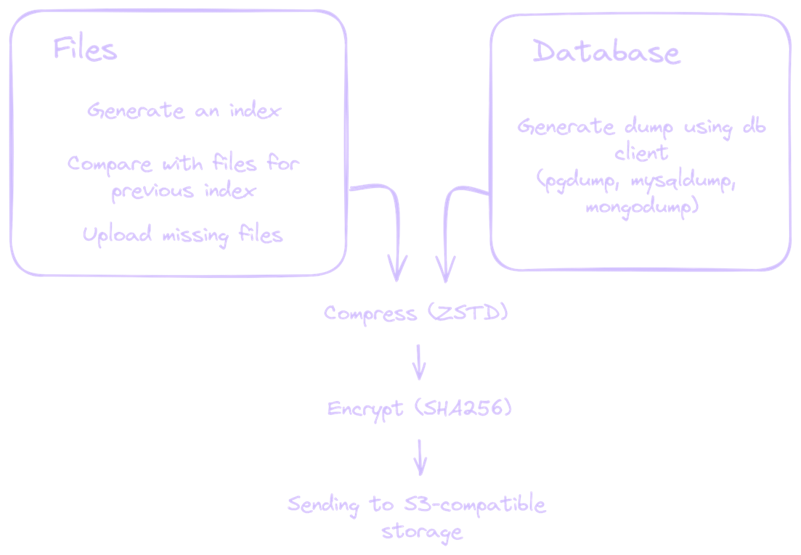

import Tabs from '@theme/Tabs';
import TabItem from '@theme/TabItem';

# Introduction

Datashelter is a fully integrated backup solution designed to simplify the process of backing up your Linux servers. With just a few steps, you can protect your critical data by backing up your files and databases to an S3-compatible storage system.
Datashelter provides seamless setup, automated backup management, and powerful recovery features—all while ensuring your data is encrypted, compressed, and deduplicated.

### Key Features

## How it works

Snaper is the command-line tool (CLI) that powers the backup process for Datashelter. Built in Golang, Snaper is a powerful, lightweight tool designed to perform backups efficiently and securely from the client side. It handles everything from file and database backup to compression, encryption, and storage transfer—all within a single, easy-to-use binary.

What makes Snaper different from traditional backup solutions is its incremental backup with file-level deduplication. Unlike tools like rsync that only back up changed or added files, Snaper uses index-based backup method. Read our dedicated blogpost [What is index-based backup](https://datashelter.tech/blog/index-based-backup/) to know more about it!

In essence, Snaper provides storage-efficient, point-in-time restoration, ensuring that you can recover your data exactly as it was at any backup point.

### Where does Datashelter store your data

At Datashelter, we are dedicated to ensuring the security, privacy, and reliability of your data. Currently, we leverage OVHcloud infrastructure to store your backups, providing access to **five availability zones** across **France** 🇫🇷 (Gravelines), **Germany** 🇩🇪 (Frankfurt), **Poland** 🇵🇱 (Warsaw), the **UK** 🇬🇧 (London), and **Canada** 🇨🇦 (Beauharnois). This strategic partnership with OVHcloud allows us to offer reliable storage at a competitive price in regions that align with your business operations and regulatory needs.

Additionally, as a fully S3-compatible solution, Datashelter offers you the flexibility to connect your own S3 bucket. This enables you to store your backups in the most convenient location for your needs—whether that’s within your existing cloud infrastructure, an on-premise solution, or another region of your choosing.

By providing both flexibility and affordability, Datashelter ensures that your data remains secure, compliant, and highly accessible without compromising on cost.

**Just give us a try and you will see 🚀**
