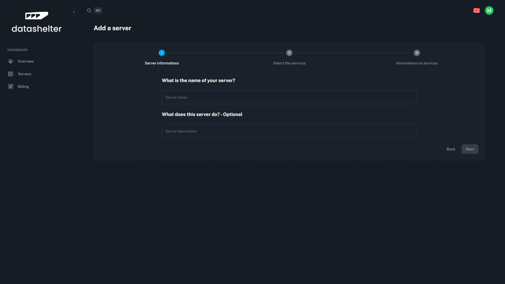
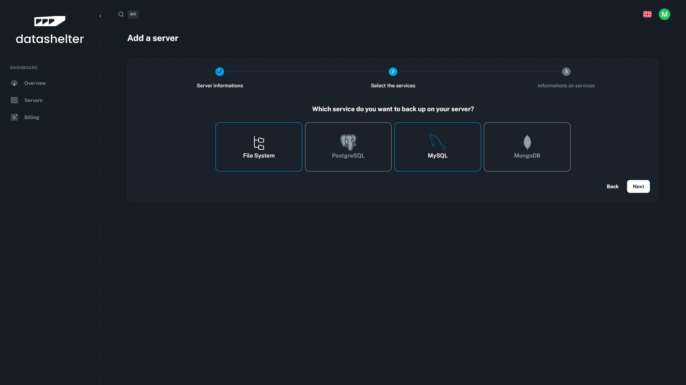
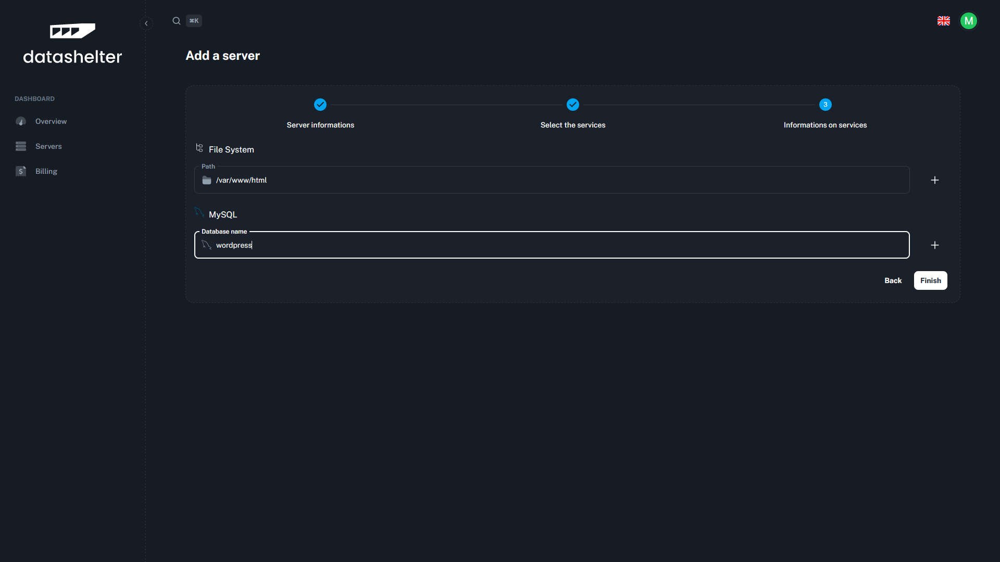
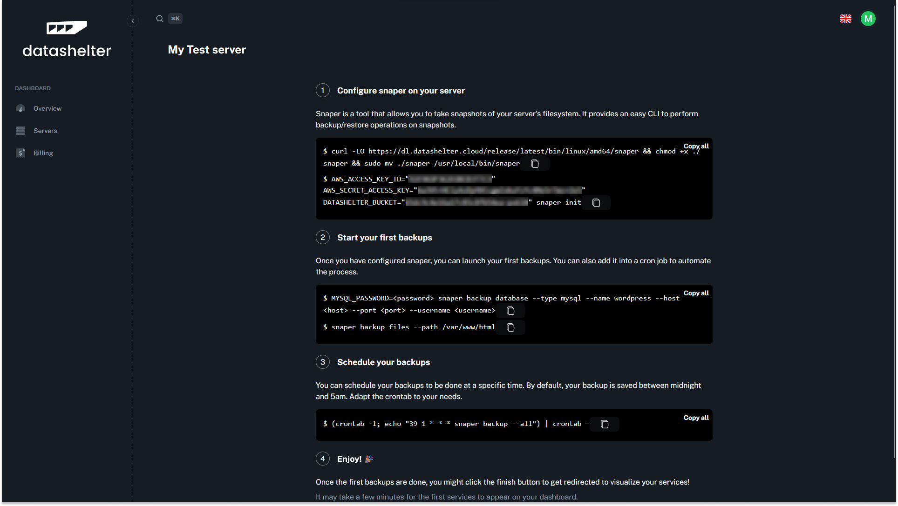

# Quickstart

## Create an account on Datashelter

Create an account on [app.datashelter.tech](https://app.datashelter.tech)


## Add you first server

Add your first server on the dashboard. You will be prompted to install the snaper CLI on your server and to configure it.


1. **Click on the "Add server" button**


2. **Set the server name and a description**


3. **Select the services you want to backup**


4. **Fill in the services informations**


5. **Launch snaper install and configuration command on your terminal to perform your first backup**


## Setup recurring backups

Once the snaper CLI is installed and configured, you can setup crontabs to schedule your backups.

```
crontab -e
---
# Backup your files every day at 3am
0 3 * * * /usr/local/bin/snaper backup --all 2>&1 >> /var/log/snaper.log
```

## Enjoy 🚀

We will take care of the rest for you. You can now relax and focus on your business. We’ll alert you if something goes wrong and keep your backups safe and secure.