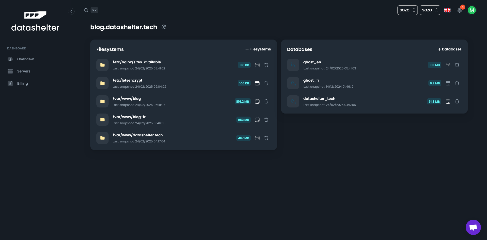

# Backup incident troubleshooting guide

This guide walks you through the steps to identify and resolve backup issues reported via email. The goal is to help you fix the problem quickly, or gather the right info before reaching out to our support team.

## Step 1: Spot services with errors

1. Log in to your Datashelter dashboard.
2. Click on **Servers**, then select the server in question.
3. You’ll see a list of your services, each showing the date of the last snapshot.
4. If a service has no date, or the date looks outdated, it’s likely where the issue is.

> **Tip:** Keeping an eye on snapshot dates helps catch problems early.



## Step 2: Check the backup logs

- Backup logs are stored locally on your server at `/tmp/snaper`.
- To see which backup name matches which path, run:

  ```bash
  snaper list files
  ```

  Example output:

  ```
  BACKUP NAME    PATH
  -----------    ----
  crimson-surf   /etc/nginx/sites-available
  summer-sea     /etc/letsencrypt
  damp-cloud     /var/www/blog
  spring-fog     /var/www/blog-fr
  purple-tree    /var/www/datashelter.tech
  ``

## Step 3: Try a manual backup

Once you’ve identified the service, you can re-run its backup manually using:

```bash
snaper backup <files/database> --name <servicename>
```

Example:

```bash
snaper backup files --name crimson-surf
```

If the backup completes successfully, you’re all set. If it fails again, move on to the next step.

## Step 4: Get in touch with support

Still stuck? We’re here to help.

You can contact us:
- Through the live chat on your dashboard
- Or by email: support@datashelter.tech

To help us assist you quickly, please include:
- The name of your server
- The name of the affected service
- And if possible, the error message you’re seeing

> 🤝 Our support team is always happy to give you a hand.
