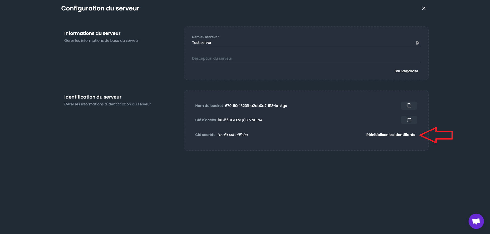

# Changer les identifiants d'un serveur

Vous pouvez simplement changer les identifiants d'un serveur suite à une accès non autorisé ou pour des raisons de sécurité. Pour cela, rendez-vous dans la section "Serveurs" de votre tableau de bord, puis cliquez sur la roue crantée en haut à droite.

Vous pouvez ensuite cliquer sur "Réinitialiser les identifiants" pour modifier le nom d'utilisateur et le mot de passe du serveur.

:::note
Pensez à mettre à jour votre configuration snaper avec les nouvelles clés, en éditant le fichier _~/.config/snaper/config.yaml_.
:::
