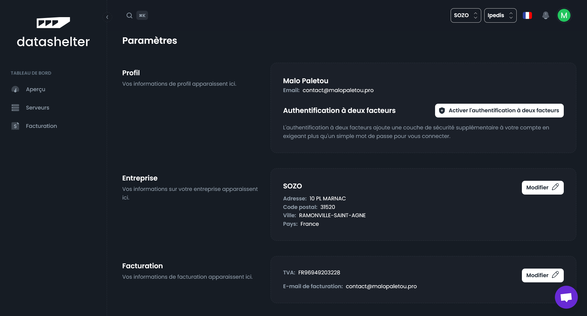
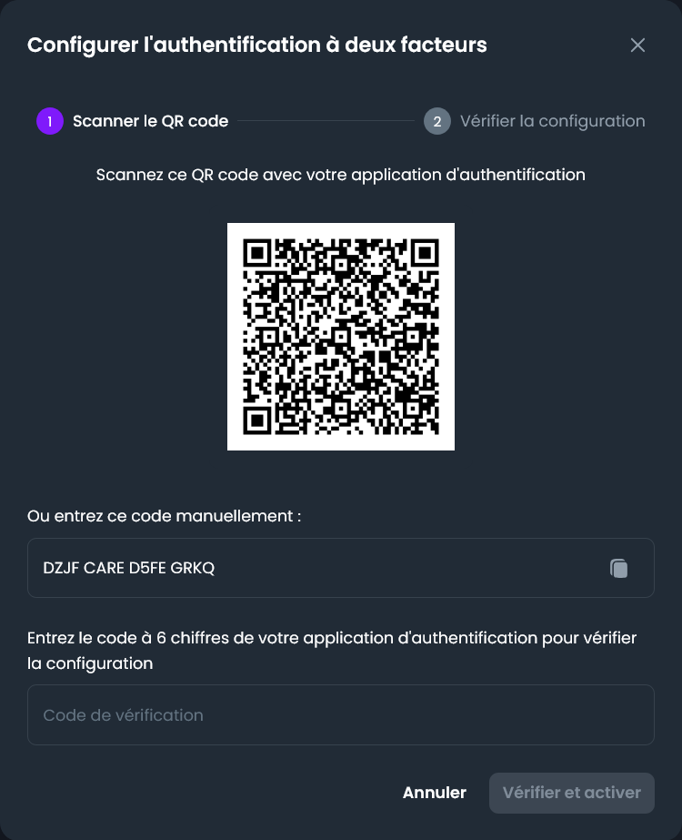
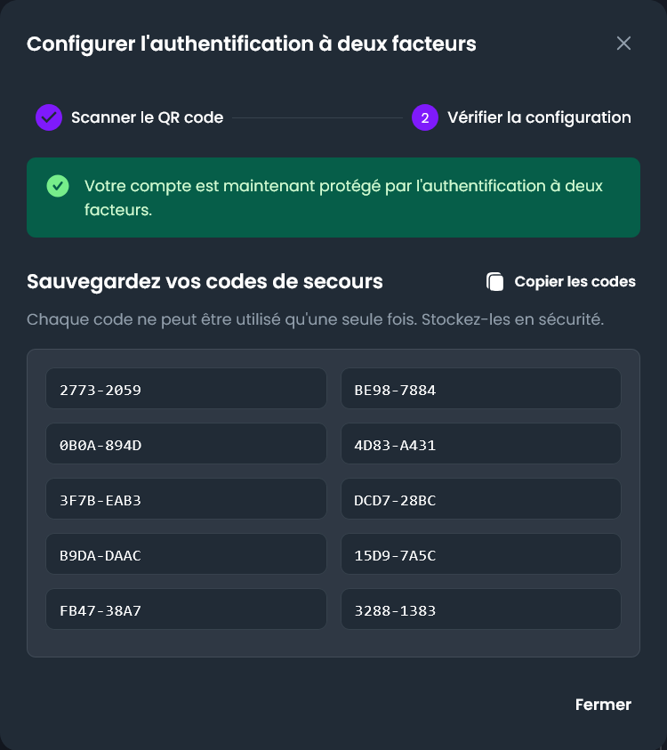
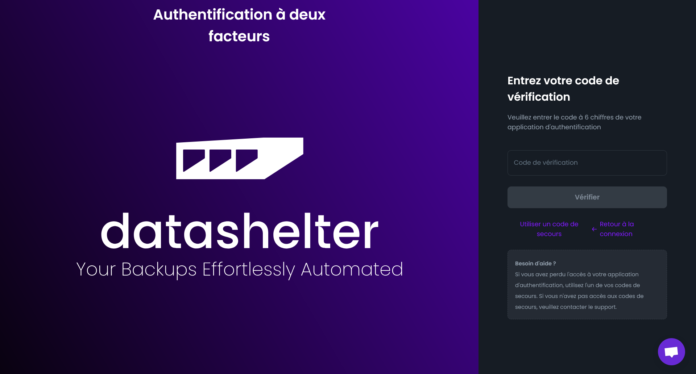

# Comment activer l’authentification à deux facteurs (2FA) ?

### 1. Accéder aux paramètres de votre dashboard en cliquant sur la roue crantée en haut à droite
    
    
    
### 2. Cliquez sur le bouton “Activer l’authentification à deux facteurs”
   
### 3. Scannez le code QR avec un application OTP
Les applications Google Authenticator ou Proton Authenticator peuvent être utilisées.
Vous pouvez aussi copier/coller votre clé pour l’importer dans votre gestionnaire de mot de passe par exemple
    
    
    
### 4. Spécifiez le code de vérification à six chiffres retourné par votre application OTP
   
### 5. Conservez vos codes de récupération en sécurité
   Ces codes de récupération vous seront nécessaires pour restaurer l’accès à votre compte en cas de perte de votre appareil d’authentification.
    
    
    
### Vous êtes prêt 🎉
Dès votre prochaine connexion, le code de double authentification vous sera demandé. En cas de perte, vous pourrez récupérer l’accès en utilisant vos codes de secours ou en contactant l’équipe support sur support@datashelter.tech

    
