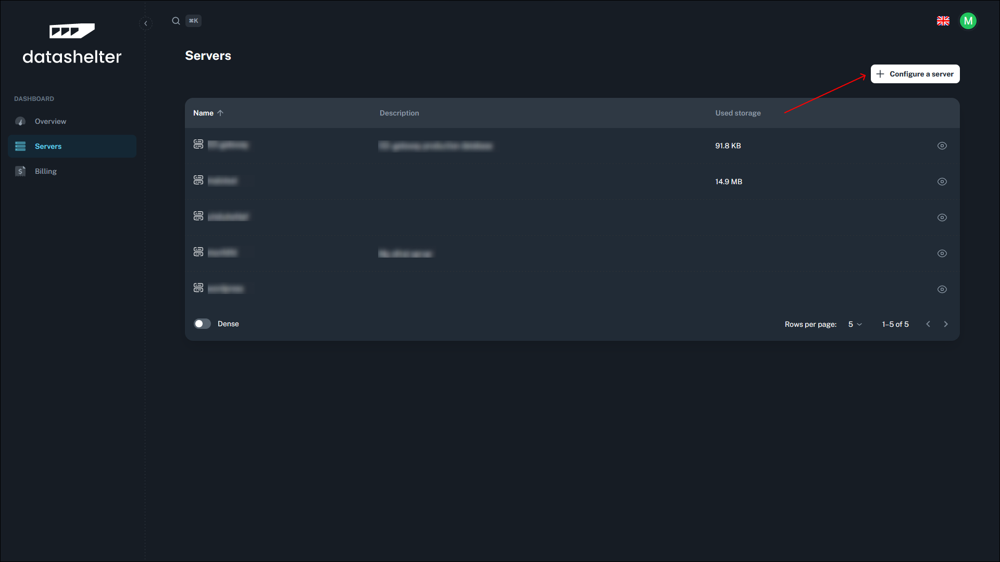
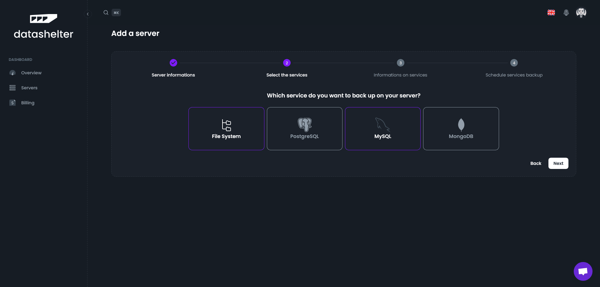

# Guide de démarrage

## Créez un compte sur Datashelter

Créez un compte sur [app.datashelter.tech](https://app.datashelter.tech)

## Ajouter votre premier serveur

Ajoutez votre premier serveur sur le tableau de bord. Vous serez invité à installer le CLI snaper sur votre serveur et à le configurer.

### 1. Cliquez sur le bouton "Ajouter un serveur"

### 2. Définissez un nom et une description pour votre serveur

### 3. Sélectionnez les types de services que vous souhaitez sauvegarder

### 4. Fournissez les détails des services

### 5. Planifier la sauvegarde automatique (optionnelle)

### 6. Lancer les commandes de configuration dans votre terminal

## Profitez ! 🚀

Nous nous occupons du reste pour vous. Vous pouvez maintenant vous détendre et vous concentrer sur votre activité. Nous vous alerterons en cas de problème et nous veillerons à ce que vos sauvegardes soient sûres et sécurisées.