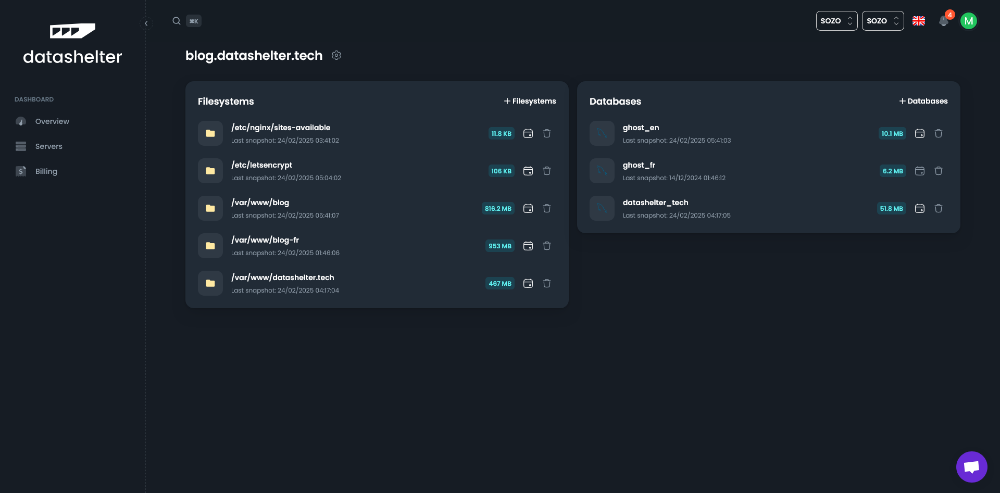

# Résolution des problèmes de sauvegarde manquante

Ce guide vous explique les étapes pour identifier et résoudre les problèmes de sauvegarde signalés par email. L'objectif est de vous aider à résoudre rapidement le problème ou à recueillir les informations nécessaires avant de contacter notre équipe de support.

## Étape 1 : Identifier les services en erreur

1. Connectez-vous à votre tableau de bord Datashelter.
2. Cliquez sur **Serveurs**, puis sélectionnez le serveur concerné.
3. Vous verrez une liste de vos services, chacun affichant la date du dernier instantané.
4. Si un service n'a pas de date ou si la date semble obsolète, c'est probablement là où se trouve le problème.

> **Astuce :** Surveiller les dates des instantanés permet de détecter les problèmes rapidement.



## Étape 2 : Vérifier les journaux de sauvegarde

- Les journaux de sauvegarde sont stockés localement sur votre serveur dans `/tmp/snaper`.
  Par exemple, pour la sauvegarde `crimson-surf`, vos logs sont disponibles dans le fichier `/tmp/snaper/crimson-surf.log`

  ```bash
  tail -n 100 /tmp/snaper/crimson-surf.log
  ```

- Listez les sauvegardes configurées sur votre serveur (et leurs chemins correspondants) avec la commande suivante :

  ```bash
  snaper list files
  ```

  Exemple de retour :

  ```
  BACKUP NAME    PATH
  -----------    ----
  crimson-surf   /etc/nginx/sites-available
  summer-sea     /etc/letsencrypt
  damp-cloud     /var/www/blog
  spring-fog     /var/www/blog-fr
  purple-tree    /var/www/datashelter.tech
  ```

## Étape 3 : Essayer une sauvegarde manuelle

Une fois que vous avez identifié le service, vous pouvez relancer sa sauvegarde manuellement en utilisant :

```bash
snaper backup <files/database> --name <servicename>
```

Exemple :

```bash
snaper backup files --name crimson-surf
```

Si la sauvegarde est réussie, tout est réglé. Si elle échoue à nouveau, passez à l'étape suivante.

## Étape 4 : Contacter le support

Toujours bloqué ? Nous sommes là pour vous aider.

Vous pouvez nous contacter :
- Via le chat en direct sur votre tableau de bord
- Ou par email : support@datashelter.tech

Pour nous aider à vous assister rapidement, veuillez inclure :
- Le nom de votre serveur
- Le nom du service concerné
- Et si possible, le message d'erreur que vous voyez

> 🤝 Notre équipe de support est toujours heureuse de vous aider.
