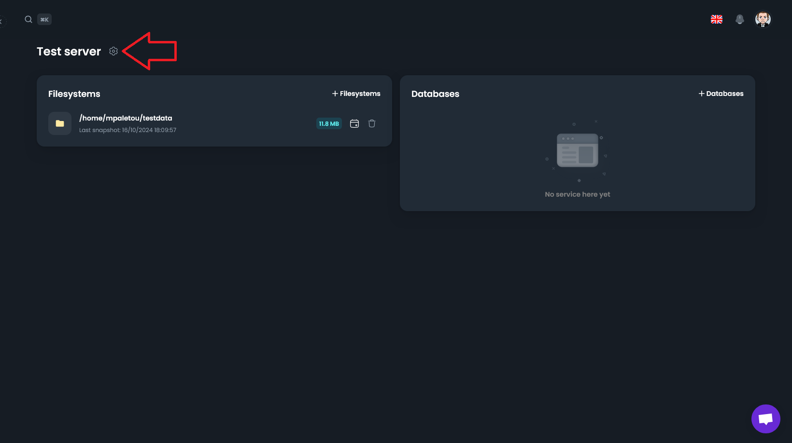

# Changer le nom ou la description d'un serveur

Vous pouvez changer le nom d'un serveur à tout moment. Pour cela, rendez-vous dans la section "Serveurs" de votre tableau de bord, puis cliquez sur la roue crantée en haut à droite.

